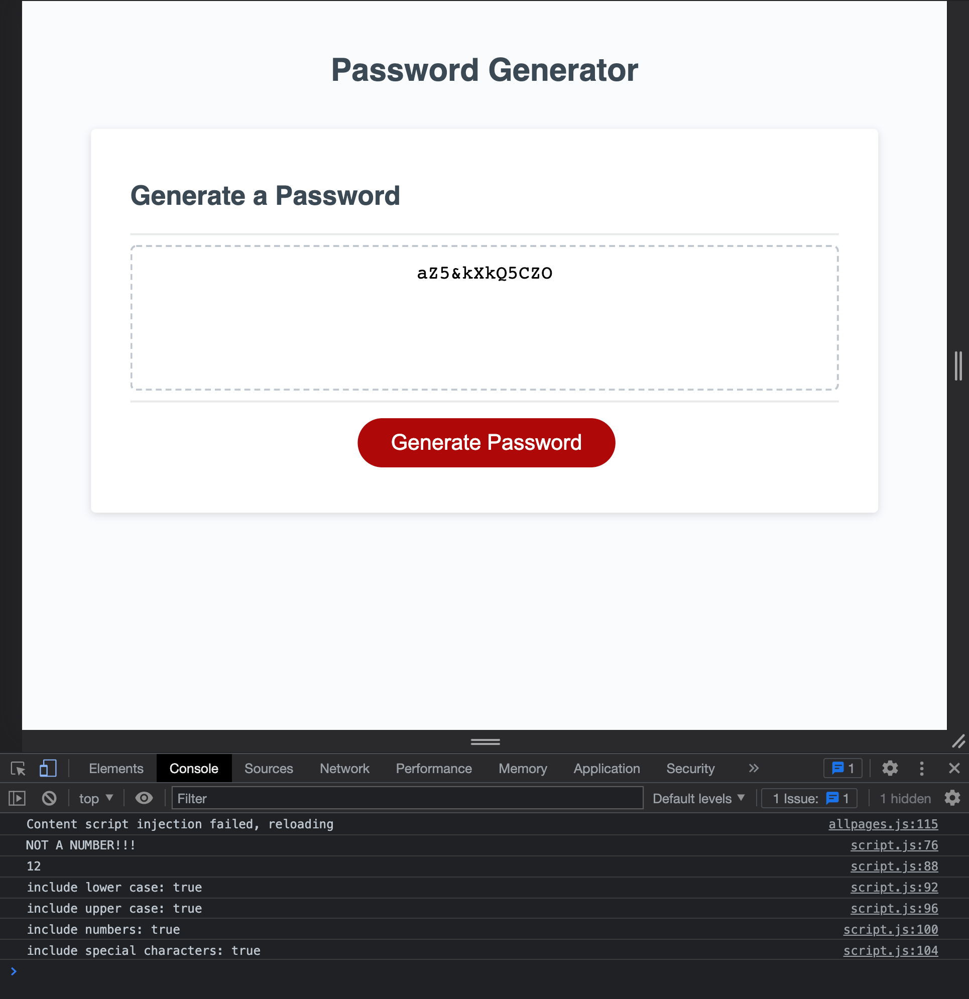
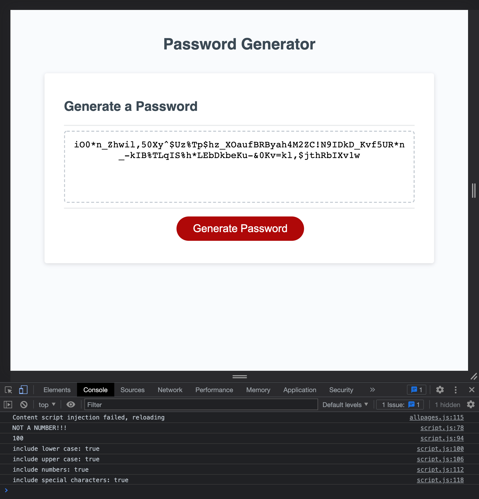

# homework-week-3

This week's homework is about creating password generator "app". 

When the user clicks on the "Generate Password" button, a series of window prompts should ask the user to confirm the criteria with which the new password should be generated. 

The HTML and CSS codes were already provided. Only JS code was added to make this app work as expected.

## Links

Here are the required links with the end result:
* Link to the deployed application on GitHub Pages: https://nnassarv.github.io/homework-week-3/
* Link to the GitHub repo: https://github.com/nnassarv/homework-week-3

## Description

In order to solve this task, I started by defining the arrays of possible characters to be used. These arrays were differentiated by their type. That is, an array for lower case letters, for upper case letters, for numbers, and for special characters

The I implemented the prompts where the user will provide input. 
The first prompt asks for the desired length of the password and the value returned must be a number. The rest of the prompts are booleans asking the user which character types they want to use.

Based on the input from the user, we create new arrays which become sort of "character pools" where we will later, randomly, retrieve the number of characters that the user requested (password length). 

We also make sure that there is a pool for "guaranteed values." This is nothing else than a way to make sure that at least one value from each of the selected value types will be included in the final random password.

We then use the length given by the user and use it to iterate over "the pools" where we finally push the random values into a final array called result. 

Finally, we take the result array, convert it to a string and then publish it in the corresponding field in our app.

## Screenshots

Here's a screenshot of the app generating a 12 character random password (including the console view):

And here's a screenshot of the app generating a 12 character random password (including the console view):
